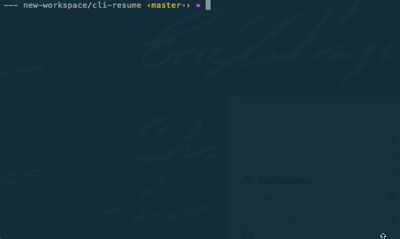

# Interactive Command Line Resume

Get to know a job candidate with this simple and iteractive resume.

## Getting Started

These instructions will get you a copy of the project up and running on your local machine.

### Prerequisites

Install [Python 3.6](https://www.python.org/downloads/)

### Installing
Clone repo:

```
git clone https://github.com/wocaldwell/cli-resume.git
```

Run project in cli:

```
python interactiveResume.py
```
In your terminal you should see somthing like this:


## Built With

* [Python](http://www.dropwizard.io/1.0.2/docs/) - Main Language

## Authors

* **William Caldwell** - [wocaldwell](https://github.com/wocaldwell)

## Acknowledgments
"Thank you all and GOOD NIGHT!" - Every Musician Ever